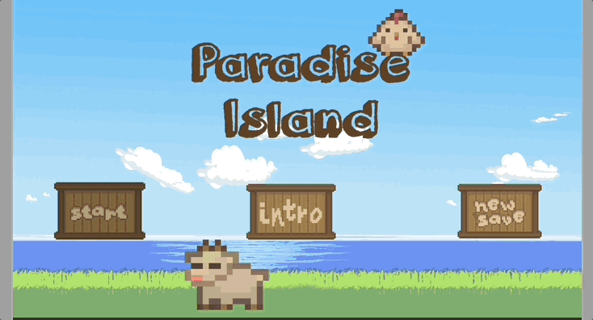
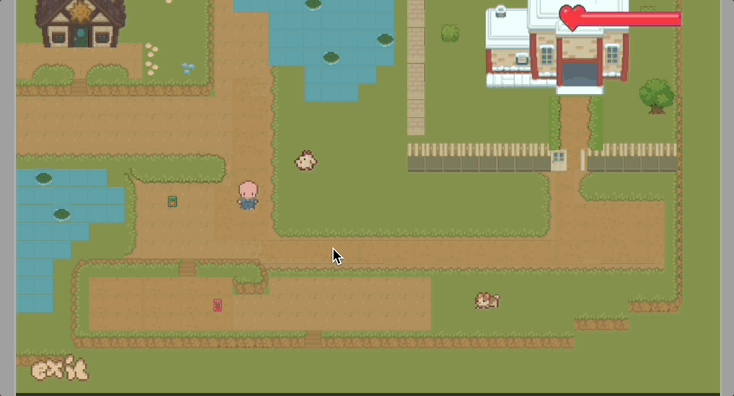
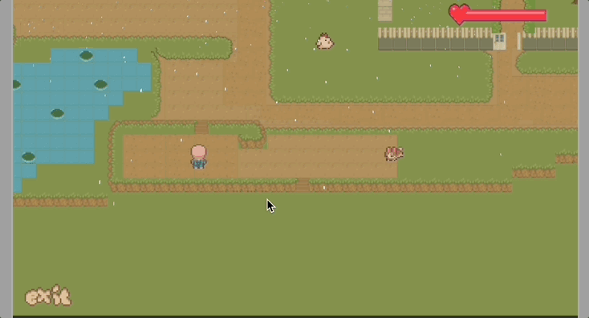
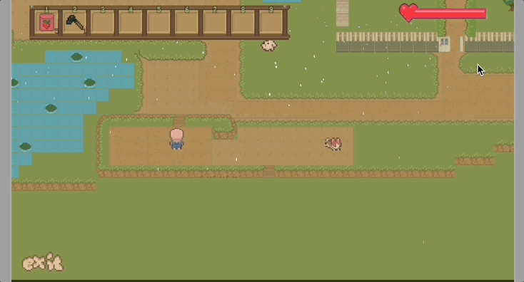
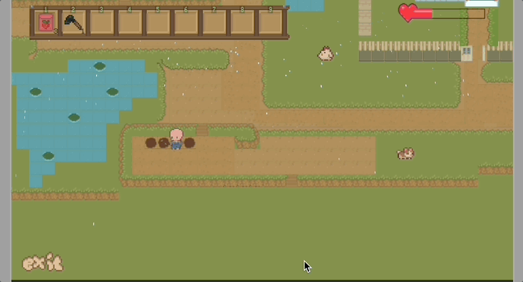
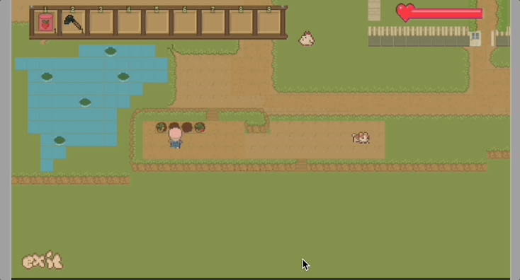

#  Paradise Island--- a relax game for hoeing, planting and exploring

**Paradise Island is a cozy, casual farming game where players take on the role of a new farmer in a peaceful countryside village. The gameplay revolves around relaxing activities such as digging soil, planting seeds, harvesting crops, and collecting items in an open-ended world. There are no enemies, time pressures, or failure states—just a slow- paced life where players can grow their farm and enjoy nature!**

---

## 🖼️ Gameplay Preview

### screenshots:
-start game

-pick up things

-choose tool

-hoe the ground

-planting

-harvest and pick fruit

---

## 🎮 Core Features in the Game

-1. Digging (Tilling Soil): Players use a hoe to till soil in designated areas. Importance: Essential for planting; drives the farming loop forward. 

-2. Planting Seeds: Players plant seeds on tilled soil; different crops have different growth times. Importance: Key to generating resources and building player satisfaction. 

-3. Harvesting Crops: Mature crops can be harvested and stored in the backpack. Importance: Reward loop for player effort; source of income and progress. 

-4. Collecting Items: Randomly spawned items (flowers, sticks, rocks, etc.) can be found across the map. Importance: Encourages exploration; adds variety and crafting/selling opportunities. 

-5. Backpack System: An upgradable inventory system for storing tools, seeds, and harvested goods. Importance: Core to resource management; drives upgrade decisions.

-6. Weather System:Control the weather to be sunny or rainy, which may influence the action of seed growing and planting. Important:simulate the reality world that the weather will influence the growth of plants

-7. Health System: some physical actions like digging will lose health point, when it under 0, players can not do the physical work.

---

